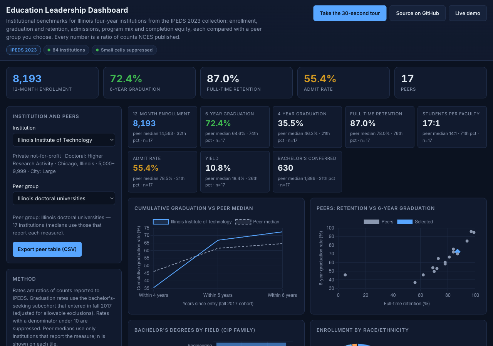
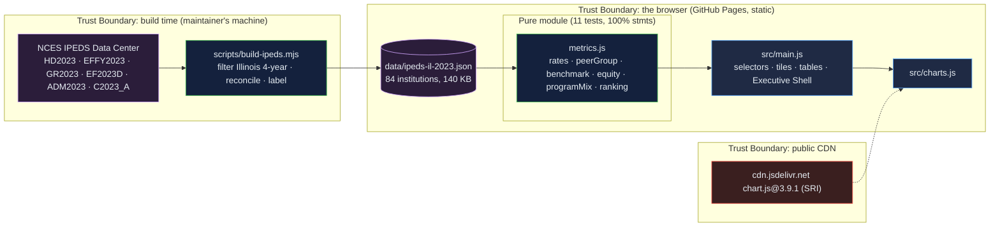

# Education Leadership Dashboard: IPEDS benchmarks for Illinois institutions, every number a ratio of published counts

[](https://github.com/Freddricklogan/Education-Leadership-Dashboard/actions/workflows/deploy.yml)
[](#5-getting-started--verification)
[](https://github.com/Freddricklogan/Education-Leadership-Dashboard/actions/workflows/codeql.yml)
[](LICENSE)
[](https://freddricklogan.github.io/Education-Leadership-Dashboard/)

## 1. Executive Summary & Business Impact

**Problem statement.** Leadership dashboards in higher education are
often mock-ups that never met a dataset: a graduation rate with a green
arrow, a department table with star ratings, a sidebar of links to
nowhere. The previous version of this page was exactly that — "12,450
students", "87.3 %", "$1.2B endowment", all typed into the markup, with
a user guide explaining how to read them (`AUDIT.md`).

**Solution & value delivered.** A benchmarking dashboard over the IPEDS
2023 collection for the 84 Illinois public and private not-for-profit
four-year institutions, built by a script from the NCES Data Center
files and reconciled before it is written. Pick an institution and a
peer group — Carnegie class, control, size or all of Illinois — and see
12-month enrollment, 4- and 6-year graduation, full-time retention,
students per faculty, admit rate, yield and bachelor's conferred, each
with the peer median, the percentile rank and how many peers report it;
cumulative graduation against the peer median; program mix by CIP
family; enrollment composition; six-year completion by race and
ethnicity with small cells suppressed; and a ranking table on any
measure. Export the peer table as CSV.

**[→ Read the full case study](docs/CASE_STUDY.md)**



## 2. Demonstrated Competencies & Technical Skills

- **Educational Data & Institutional Research** — IPEDS survey
  components (HD, EFFY, GR, EF-D, ADM, C), graduation-rate cohort
  definitions, CIP families, Carnegie classifications, small-cell
  suppression, equity-gap reporting.
- **Data Engineering** — reproducible build from public files with
  reconciliation assertions (completions by family equal the grand
  total; 4+5+6-year completers equal the 150 % figure; men plus women
  equal total enrollment).
- **Data Science & Statistics** — medians and percentile ranks over
  reporting peers only, directional rankings, gap-to-overall measures.
- **Security & Engineering Practice** — strict CSP, SRI with a vendored
  fallback, `textContent` only; 100 % statement coverage of the metrics
  module with hand-checked values for one institution.

## 3. System Architecture & Data Flow



No backend, no account, no telemetry. The browser never calls NCES; the
dataset is a committed file with its build date and source files
printed on the page.

## 4. Technical Highlights & Engineering Decisions

### ADR-1 — Build from IPEDS, refuse to write an unreconciled file

**Context.** The old page had no data at all. A real one needs data a
reader can trace.

**Decision.** `scripts/build-ipeds.mjs` downloads six IPEDS 2023 files,
filters to Illinois four-year Title IV degree-granting institutions
under public or private not-for-profit control, joins the surveys by
UNITID, and asserts that bachelor's completions by CIP family sum to
the reported total for every institution before writing. The test suite
re-checks that and two more identities.

**Consequence.** The dataset is regenerable from the source with one
command, and an inconsistency in a future release fails the build
rather than reaching the page.

### ADR-2 — Peer groups and reporting counts, not a single number

**Context.** A rate without a comparison is decoration; a median over
institutions that do not report the measure is wrong.

**Decision.** Seven peer groups drawn from the same file; every tile
shows the peer median, the percentile rank and `n`, the count of peers
that report that measure. Rankings run in the right direction (students
per faculty low to high).

**Consequence.** Switching from doctoral peers (17) to all Illinois (84)
moves a 6-year graduation median from 64.6 % to 59.0 % on the page, and
the reader can see that 57 of 84 report it.

### ADR-3 — Suppress small cells

**Context.** IPEDS publishes counts; dividing a cohort of one gives a
0 % or 100 % that misleads.

**Decision.** Any rate with a denominator under 10 is suppressed and
labelled, in tiles and in the equity table, and the number of
suppressed groups is stated.

**Consequence.** The equity table can be read as a leadership document
without a footnote explaining why one group shows 100 %.

## 5. Getting Started & Verification

**Prerequisites.** Node 22 LTS; `unzip` on PATH to rebuild the dataset.
No build step for the page; it is served from the repository root.

```bash
git clone https://github.com/Freddricklogan/Education-Leadership-Dashboard.git
cd Education-Leadership-Dashboard
npm ci
npm run lint && npm run validate && npm run coverage
npx serve .    # open http://localhost:3000
node scripts/build-ipeds.mjs   # optional: rebuild data/ipeds-il-2023.json from NCES (downloads ~20 MB)
```

**Verification — the numbers this repository actually produced:**

```bash
npm run coverage   # 11 passed / 11; All files 100% stmts, 89.21% branches
npm run lint       # 0 problems
npm run validate   # html-validate index.html: clean
```

| Check | Result |
| --- | --- |
| Unit tests (Vitest) | **11 passed / 11** |
| Coverage (pure module) | **100%** statements, **89.21%** branches (`main.js`, `ui.js`, `charts.js` covered by the browser smoke test) |
| ESLint, html-validate | clean |
| Dataset | 84 institutions; 84 with enrollment, 58 with a graduation cohort, 56 with admissions; completions reconcile for all; built 2026-09-21 |
| Hand check (Illinois Institute of Technology, UNITID 145725) | enrollment 8,193 (3,517 undergraduate); cohort 468, completers 339 → 72.4 %; within 4 years 166 → 35.5 %; retention 87 %; 17:1; applicants 8,912, admitted 4,939, enrolled 534; 630 bachelor's (Engineering 273) — matched independently in Python against the raw CSVs |
| Headless Chrome smoke | **0 console errors**; doctoral peers 17, median 6-year 64.6 %, IIT 74th percentile; all-Illinois peers 84, median 59.0 %, n=57; equity table 8 groups with 1 suppressed, widest gap 36.9 points; seminary shows "not reported"; ranking direction correct for students per faculty; four tour steps; no horizontal scroll at 1280 or 400 px |

## 6. Live Demo & Production Showcase

**<https://freddricklogan.github.io/Education-Leadership-Dashboard/>**

**30-second guided walkthrough.** Press **Take the 30-second tour**: it
explains what each tile divides, switches the peer group to all of
Illinois so you can watch the medians move, shows the equity table with
its suppression rule, and ranks the peers on retention. Then pick your
own institution.
